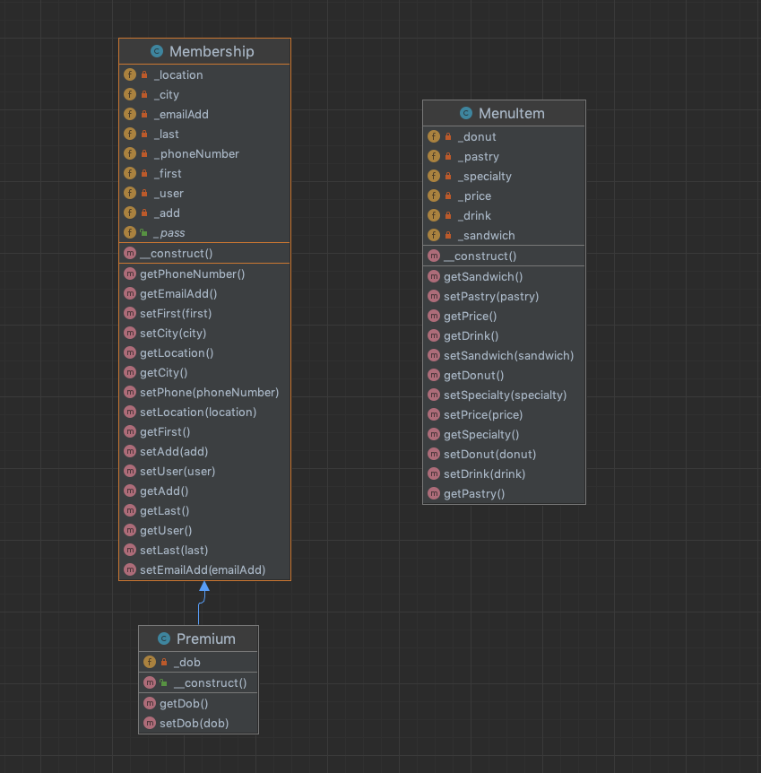

# KCBakery

A website for a bakery that allows patrons to place an order for pickup at a small specialty bakery. Users have the ability to create a membership account. They also may choose to create a premium membership account, which would entitle them to a free item on their birthday. 

#Authors

<ul>
<li><b>Cherie</b>- Co-Founder/ Developer</li>
<li><b>Keny</b>- Co-Founder/ Developer</li>
</ul>

#Project Requirements

<ol>
<li>Separates all database/business logic using the MVC pattern.</li>
<ul>
    <li>DataLayer and Validation classes are under the model folder</li>
    <li>All HTML view pages are under the views folder</li>
    <li>All routes to the html views are inside the index.php file</li>
    <li>index.php calls the Controller function to get the data fom the model and to return the views</li>
    <li>All classes are underneath the classes folder</li>
</ul>
<li>Routes all URLs and leverages a templating language using the Fat-Free framework.</li>
<ul>
    <li>All routes are included in the index.php file and uses Fat-Free to implement a templating language</li>
</ul>
<li>Has a clearly defined database layer using PDO and prepared statements.</li>
<ul>
    <li>The database layer can be found in the model folder in the data-layer2 file</li>
    <li>There are three related tables- signup, menu_item, and summary order</li>
</ul>
<li>Data can be added and viewed.</li>
<ul>
    <li>Data can be added into the database with the signup page </li>
    <li>Data can also be added by placing an order through the menu page</li>
    <li>We were not able to add viewing data into our site</li>
</ul>
<li>Has a history of commits from both team members to a Git repository. Commits are clearly commented.</li>
<ul>
    <li>Each team member has 30+ well-commented commits on the Git repository</li>
</ul>
<li>Uses OOP, and utilizes multiple classes, including at least one inheritance relationship.</li>
<ul>
    <li>Site uses OOP</li>
    <li>3 classes have been implemented- Membership, Premium, and MenuItems</li>
    <li>The Premium class extends the Membership class</li>
</ul>
<li>Contains full Docblocks for all PHP files and follows PEAR standards.</li>
<ul>
    <li>All PHP files contain Docblocks and follow PEAR standards</li>
</ul>
<li>Has full validation on the client side through JavaScript and server side through PHP.</li>
<ul>
    <li>Signup and Membership have full-validation</li>
    <li>Server side validation can be found in model/validation2.php</li>
    <li>Client side validation can be found in script/valid_form.js</li>
</ul>
<li>All code is clean, clear, and well-commented. DRY (Don't Repeat Yourself) is practiced.</li>
<ul>
    <li>All functions are files are commented. Any code that was repeated was turned into a function that was called.</li>
    <li>Repeated code in the menu page was put into a repeat block to keep it DRY</li>
</ul>
<li>Your submission shows adequate effort for a final project in a full-stack web development course.</li>
<ul>
    <li>We were able to apply all the new techniques that we learned in the full-stack development course this quarter</li>
    <li>We learned a lot and were able to build on the basics we learned last quarter and tried new things</li>
</ul>
<li>BONUS:  Incorporates Ajax that access data from a JSON file, PHP script, or API.</li>
<ul>
    <li>We did not incorporate Ajax into our project </li>
</ul>
</ol>

#UML Class Diagram

#ER Diagram

